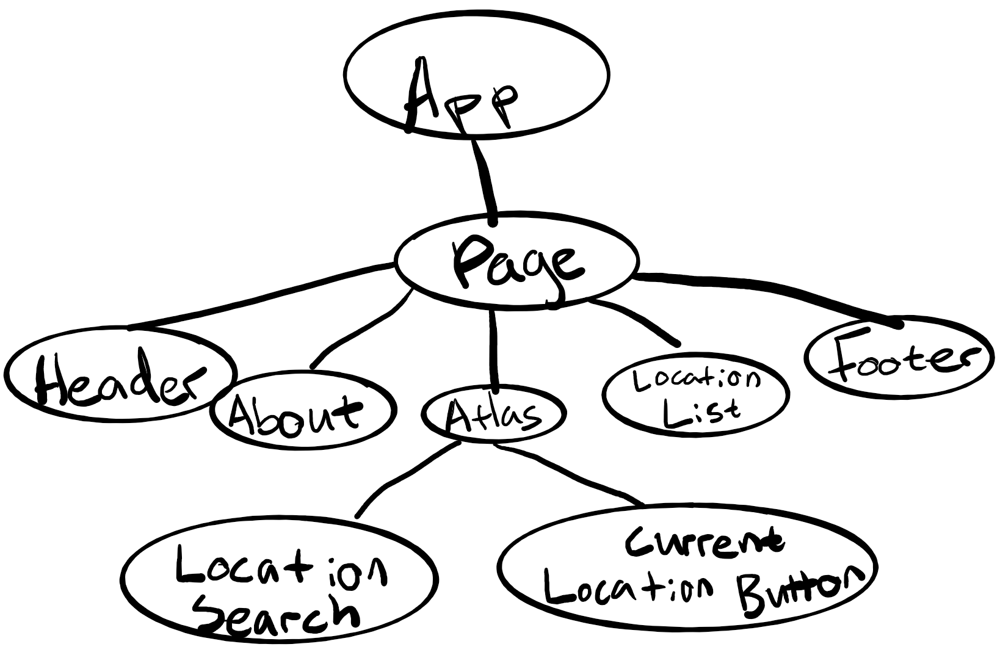

# Introduction

This document describes the architecture and design of a single page web application that interacts with microservices via RESTful APIs.
The key elements in this document include the architecture, user interface, client components, and server classes.

This is a living document that is updated as changes are made each sprint.
The initial document describes the Base code students are given as a starting point for the semester.
Students are expected to update this document as changes are made each sprint to reflect the evolution of their application and key decisions they make.
The Base section serves as an example.

# Base

The Base is a simple application to provide the architecture to the students at the beginning of the semester.
The JavaScript code will be useful examples for students to learn from and leverage in the code they write for sprint 1.
The progressive display of information using collapsible sections and popups will serve as examples of good user interface design.
The overall design is somewhat minimalist/simple for the intended mobile device audience.

### Architecture

The Base architecture is a JavaScript single page web application in an HTML5 browser that uses RESTful APIs to access Micro-services provided by a Java server running on Linux.
The client consists of a minimal index.html file that loads and executes the bundled JavaScript application.
The client and server files are bundled into a single JAR file for execution on the Linux server at a specified port.
The browser fetches the client files from the server on the specified port.

The browser loads the index.html file (by default) which in turn loads the bundled JavaScript single page application bundle.js.
* The single page application makes RESTful API requests to the server on the same port using  JavaScript's asynchronous fetch.
* A protocol document describes the JSON format for the RESTful API requests and responses.
* JSON Schemas are used to verify requests on the server side and responses on the client side.
* On the client, ReactJS renders the application using ReactStrap, Leaflet, and application defined components.
* GSON is used on the server to convert JSON requests to Java objects and Java objects to JSON responses.
* The client (ulog) and server (SLF4J) logging mechanisms control debugging output during development and production - print statements and console logging should never be used.

The following architecture elements are not included in the Base system.
They will be added later in the semester.
* Client filesystem .
* Server SQL .
* Server concurrency.

### User Interface

The basic screen in black shows the view on a mobile device, with a header, footer, and map.
The header contains a earth logo and the team name obtained from the server when the client was loaded.
The footer contains a connection icon along with the current server name and server URL the client is connected to.
The blue areas highlight the actions that may be performed.

Rather than buttons or icons to signify actions, we are associating actions with elements that are already on the screen to reduce the clutter.
We are using both popups and collapsible sections in this design rather than choosing to use one exclusively.
* Collapsible/Hidden sections are used for the map and about sections since they have a significant amount of content and we don't need to see them at the same time.
* A popup is used for the URL change since we want to control the interaction until the operation is completed. It seemed more natural than another collapsible section.

#### Clicking on the map places a marker.
Whenever a user clicks on the map, the client should display a marker with latitude and longitude at that location.
We only maintain a single marker at this point displaying the most recently clicked location.

#### Clicking on the team name should tell me more about the team.
Whenever a user clicks the team name in the header, a collapsible section should appear under the header with information about the team.
The collapsible map should disappear so only the about or map are displayed.
A close button / icon in the top right corner of the about will close the about and return the map to display.
A simple toggle in state should be able to control this rendering.
The about page should contain the team name as a heading, but be otherwise blank in base.

#### Clicking on the URL in the footer should let me change the server.
Whenever a user clicks on the URL a popup should open showing the team name, the URL in an input text box, and a Cancel button.
When the user modifies the URL, a Test button should appear and the server name should disappear.
When the Test button is clicked, it will attempt to connect to the server.
If not successful, nothing changes and the user may continue to make URL changes or click the Cancel button to return to the original sever (it shouldn't change).
If successful, the new server name should appear and a Save button should replace the Test button.
When the user clicks the Save button, the server connection should change and the popup closes, revealing the new servername and URL in the footer.

### Component Hierarchy
The component hierarchy for the base application depicted below shows the our top level App component with four children components.
* App renders the major components on the screen.
* Header renders an icon and a team name in the top banner.
* Footer renders the current server connection in the bottom footer.
* Atlas renders a map.
* About renders information about the team.

We do not show the many ReactStrap components in this hierarchy, even though they will appear when you are debugging on the client.

### Class Diagram
The class diagram for the base application depicted below shows the basic structure of the web server application.

The classes in blue represent the classes specific to this application.
* WebApplication processes command line parameters and creates MicroServer.
* MicroServer start a web server on the given port, configures the server for security, static files, and APIs for different types of requests, and processes the requests as they arrive.
* JSONValidator verifies a request is properly formatted before attempting to process it using JSON Schemas.
* ConfigRequest is a specific request that allows the server to respond with its configuration to allow interoperability between clients and servers.
* RequestHeader defines the basic components of all requests.

The classes in orange represent the external libraries used by the application.
Often there are several related classes but we've listed only one to simplify the diagram.
* GSON converts a JSON string into a Java object instance.
* Spark provides the necessary web support for our MicroServer.
* JSON provides libraries to manipulate JSON objects using the JSON Schema libraries.
* Logger provides a centralized logging facility used in all of the application classes.

# Sprint 1

### User Interface

The screen shows the user interface on the mobile device. We wish we can create an "easy- to-use" mobile trip planning application, so we want to provide brief but necessary information for the trip.
The basic screen has two pages, one is information about the city and the next page is a plan table. Users can get information on the first page and add information to the plan table on the second page. 
The header has the city name and our team name. Also the logo of our team.
The footer has the URL and allows the user to switch cities. 
The blue areas shows the function of each part. 

On the first page, we give the city's description, pictures' of famous places and a map. We also use a popup for choosing cities and a hidden section of map to choose location and a button to the next page.
* Hidden section allows the user make a marker on the map. If possible, we may add traffic suggestion.
* A popup is to put a URL to change the city.
* A button turning to the next page. 

On the second page, we provide a table helping users to make a plan. Users can add/remove a row to/from the table. The table has 4 attributions: Number, time, location and comment. User can use a slide rolling up or down. Also, there is a button used to turn to the first page. 
* Table helps users to plan their trip.
* A button turning to the previous page. 

#### Clicking on the map places a marker.
Whenever a user clicks on the map, the map will put a cross surrounded by a circle on the location. 
And the detailed information shows on the button of the map including latitude, altitude and longitude. 
This map allows user to put 2 markers on the map and then the map will show a line between 2 markers.

#### Clicking on the team name should tell me more about the team.
Whenever a user clicks the team name, the description, pictures and map will disappear. 
Then a collapsible section shown under the header and this section will show the name of team, team members' name and a breif description of the team. 
The section is not cover whole page, some white section is on the left and right side of the collapsible section. 
Whenever the user click on the white section, the collapsible section disappear and city description, picture and map show up.

#### Clicking on the left/right arrow on the picture should switch the picture.
Whenever a user click the left/right arrow, the picture goes to left/right side and disappears and the next/previous picture goes to the center. 

#### Clicking on the next/previous page button should switch to the second/first page
Whenever a user click on the next/previous page button, the page goes to left/right side and disappears and the second/first page goes to the center. 

#### Clicking on the add/remove row button should add/remove a row.
Whenever a user click on the add row button. A rew row shows at the button of the table and the number is the number of new row. 
The limit of rows is 20. User can fill out the table but the number attribute can't be changed.  
A input section is beside the remove row button. 
The user can type the number in the input section and click on the remove button to remove a specific row. 
If the number of row doesn't exist, the system will show a notice: "The row does not exist." 
And then the notice disappears in 5 seconds and nothing changes.

#### Clicking on the URL in the footer should let me change the server.
Whenever a user clicks on the URL a popup should open showing input section, and a"OK" and a "Cancel" button. 
Whenever the user clicks on the "Cancel" button, the popup disappears and nothing is changed. 
The user can put a new URL in the input section. 
If the new URL is valid, then the user clicked on the "OK" button and the previous page disappear. 
The new page of the new city show on the first page. 
If the new URL is invalid, a new popup will show up and the content is "This URL is not valid" and then the new popup disappear in 5 seconds and nothing is changed. 

### Components
### Classes

### Epic Design
#### Epic 1
##### User Interface

The screen shows a change from the base screen. 
In this screen, a team identification including t24 (the ZUCCS) is added to the browser tab/HTML Title and the application header and footer. 
No component hierarchy and class diagram is implemented.

#### Epic 2
##### User Interface

The screen shows a change from the base screen. 
In this screen, more information about the entire team and member is shown. 
Whenever the user clicks on the team name on the header, a collapsible section shows and the map disappears. 
The collapsible section includes 2 subsection: Team and Members. 
Team section include the image of the whole team and team mission. 
Member section include name, image and short biography for each team member. 
The user clicks outside section and the collapsible section disappear and map returns to the page.
Component hierarchy is showned on the right side of the user interface.

#### Epic 3
##### User Interface

The screen shows a change from the base screen. 
In this screen, more information about the location is shown.
Whenever the user clicks on the map and makes a marker, a popup shows and save the location to the trip list.
There is a button on the map.
Whenever the user clicks on the button, the trip list shows below the map.
On the list, a clear all button on the top and a delete button on the right side of every row.
Users can use them to manage the trip list.
Component hierarchy is showned on the right side of the user interface.

#### Epic 4
##### User Interface

The screen shows a change from the base screen. 
In this screen, user can change the background.
Whenever the user click on the button on the right top on the map, a collapsible section shows up. 
The user can click on the preinstalled back ground and change background.
Then the collapsible section disappear and the background changes.
Component hierarchy is showned on the right side of the user interface.

#### Epic 5
##### User Interface

The screen shows a change from the base screen. 
In this screen, more information about the location is shown.
Whenever the user click on the the map, a popup shows below the map.
The popup includes textual latitude, textual longitude, information about marker and history.
After the user clicks on the close button on the top of the popup, the popup disappears.
Component hierarchy is showned on the right side of the user interface.

# Sprint 2

#### Protocol find feature

### Component Hierarchy

For this epic, the component hierarchy will not change from Sprint 1. 

#### Where am I?

### Component Hierarchy

For this epic, we will add a component for a current location button. Atlas will pass this component a function to use for onClick. Once the button is clicked, the function inside Atlas will find the users current location and pass that information to Page, where the location history is stored. The state of current location in Atlas will also be updated. 

We need to make a button above the map that will say "Find me". The market should be moved "onClick" and "onLoad".

#### Where is?

### Component Hierarchy

Here, we will add another component for the Location Search. This will initially be a text box in which the user can input latitude and longitude. Like the current location button, Atlas will pass a function which location search will call upon user entry. This function will parse the user input and update Atlas's state to display the location if the user input is valid. Again, Atlas will pass the new location to Page to store in the location history.

#### Find places

### Component Hierarchy

For this epic, the component hierarchy will remain the same. However, the Location search component will be modified to accept text input in addition to latitude and longitude. The state of the user entry will be lifted to Page, where the client will send API requests to the server, and pass the search list down to Location Search through Atlas. Once a location is selected, Location Search will pass the location information to Atlas, where the location will be displayed. Atlas will then pass the information to Page where the location will be added to the history. Page will then pass the location to Location List for the information to be displayed

# Sprint 3
### Protocol distance feature

We will implement a java class called DistancesRequest which handles api requests. The class will calculate the distance between a list of locations given in the request, and return the distance to the client. The class will also handle a "earth radius" property, which will be used to decide which direction to calculate distances for. 

### Calculate distances

Here, we will use our distances api in our client application. We will have a function which sends distances requests to our server, and displays this information to the client. We will keep track of the distances between all of the locations in the history. 

### Show trip

Here, we will add a button to display the current trip by connecting the clicked locations with lines on the Atlas. The last destination clicked will also be connected to the original starting location. 

### Mark selected

For mark selected we will create checkboxes next to items on the list. When they are clocked a marker will be displayed on those items correct latitude and longitude on the map.

# Sprint 4

### Search More
The search bar will be more convinient. If the user type a partial or whole city, state, country or airport code into the search bar, then the search bar function will send a request to the server. If the response is not null, then the searched places will be added to the location list. 

### Protocol Tour Feature
Tour Feature will create a file in the client to send request and another file in the server to receive the request and send response back to the client. The request and response should be strictly as they in the Specification file. Heuristic optimization techniques should be used to improve large trips and concurrency should be used to reduce the computation time for the optimization techniques.

### Save Tour

Save tour will add a new button to our layout, then when clicked opens a popup where you can eneter the name to save the tour by.

### Load Tour
Load tour will add a new button as pictured in the save tour diagram, to the right of save tour, that when clicked will open up a scroll menu with all the different saved tours. When a tour is clicked it will be loaded and the scrolldown menu will be closed. Their will also be an x after each entry to delete unneeded entries.

### Shorter Tour

The user would like a shorter tour that visits all of the destinations. So we will add a dropdown on the lead tour button that will include a button for shorter tour

### Modify Tour

The user would like to make changes to the tour.
-Let the user select a new string location while maintaining the order of the destinations.
-Let the user reverse the order of the destinations from the starting location. 
-Let the user reorder individual destinations.
-Let the user remove destinations.
-Let the user add notes about a destination or correct mistakes in the existing information about a place.
We will make a button next to each tour place that will have midification options collapsed into one field. Such as delete, reorder, add notes.

# Sprint 5

### Server Settings
The popup menu on the footer which allows users to connect to other servers will be improved so that users can view more information about the server they would like to connect to. The popup will display the server name, a list of supported features (find, distances, tour, etc.), and the 'type' and 'where' attributes. The list of features will be displayed neatly as a list, with the 'type' and 'where' attributes hidden until the user clicks to expand each category.

#### User Interface

#### Component Hierarchy
The component hierarchy will remain the same.

### User experience
We will survey users outside this class to learn more about their experience using your application and identify changes to improve their user experience. Each student should get feedback from one other person outside the class and post their notes per the assignment.
Possible areas of improvement include that we grade on include:
mobile user format responsive to different sizes and orientations.
eliminate clutter, show the fewest visual elements possible at a time.
progressive disclosure of information to user
easy navigation, minimal click to achieve something
minimal scrolling required
meaningful icons and labels
consistent with CSU web style guidelines

### Interoperability
We will allow our client to work with the servers of other teams, and our server to service the clients of other teams. As part of this, we will test the interoperability of other teams, and they will test the interoperability of our server. 

### Filter Tour
For this epic we will add a button above the location list. The left side of the search bar will have a drop down menu with search bars next to
each item that will allow you to type in the phrase next to the type (name, city country, etc) you want to filter by. THis implementation will 
allow us to search by multiple filters at once.

### Modify tour
The design of this epic is similar to the one in the sprint 4. We may improve the operation on rescheduling destination. We may remove some button and make
it in a more effective way.

### Mark selected
The design of mark selected is similar to the one in the sprint 3. The previous function lets all markers show together, and this time, when user clicks a location, 
only one marker will show on the map. 

### Final Design

